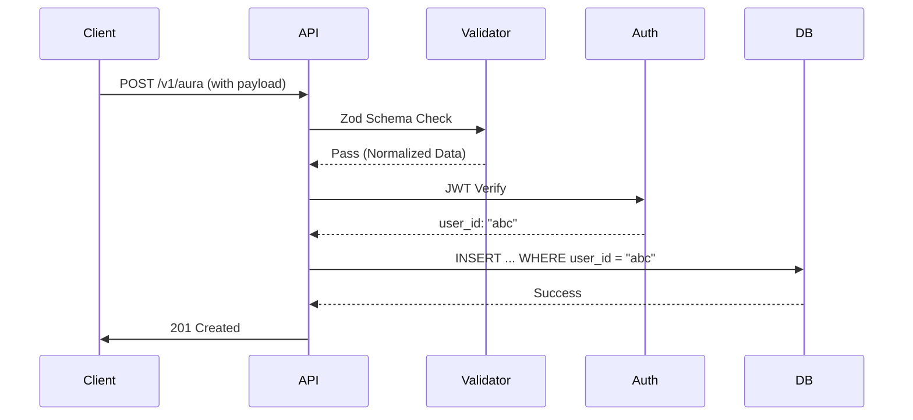

# HerLife Advanced Backend Security Guide

This guide details the elite security implementations used in the HerLife backend to prevent high-impact vulnerabilities.

## 1. Injection Attacks (SQL & NoSQL)

### The Attack
Injecting malicious queries to bypass authentication or dump database contents.
- **SQLi Payload:** `admin' OR '1'='1' --`
- **NoSQLi Payload:** `{"username": {"$gt": ""}, "password": {"$gt": ""}}`

### ❌ Insecure Code (Concatenation)
```typescript
// DANGEROUS: Direct concatenation
const user = await db.raw("SELECT * FROM users WHERE email = '" + req.body.email + "'");
```

### ✅ Secure Code (Parameterized Queries)
We use the ORM's parameterized query engine which treats input as data, never as executable code.
```typescript
// SECURE: Uses prepared statements/parameterized queries
const user = await db('users').where({ email: req.body.email }).first();
```

---

## 2. Insecure Direct Object Reference (IDOR)

### The Attack
Changing a URL parameter (e.g., `/api/profile/101` to `/api/profile/102`) to access another user's data.

### ❌ Insecure Code (Trusting User Input)
```typescript
router.get('/chat/:id', async (req, res) => {
    const chat = await db('chats').where({ id: req.params.id }).first();
    res.json(chat); // BUG: No check if this chat belongs to the requester!
});
```

### ✅ Secure Code (Automatic Scoping)
Every query is automatically scoped to the `authenticated_user_id`.
```typescript
router.get('/chat/:id', authenticate, async (req, res) => {
    const chat = await db('chats')
        .where({ id: req.params.id, user_id: req.user.id }) // Scoping
        .first();

    if (!chat) return res.status(404).json({ error: 'Not found' });
    res.json(chat);
});
```

---

## 3. JWT Tampering & Replay Attacks

### The Attack
- **Tampering:** Changing the `user_id` inside a JWT to escalate privileges.
- **Replay:** Stealing a valid JWT and reusing it multiple times.

### Protection Strategy
1. **Signature Verification:** Backend uses a strong HS256/RS256 secret.
2. **Short Expiration:** Tokens expire in 15-60 minutes.
3. **JTI (JWT ID):** Every token has a unique ID stored in a Redis "allow-list" or used to detect replays.

---

## 4. Enumeration & Information Disclosure

### The Attack
Using response differences to determine if a user exists (e.g., "User not found" vs "Wrong password").

### Protection
- **Generic Errors:** Always return "Invalid credentials".
- **404 for Everything:** If a resource exists but the user doesn't own it, return `404 Not Found`, not `403 Forbidden`. This prevents attackers from knowing the resource exists.

---

## 5. Mass Assignment

### The Attack
Injecting extra fields into the request body to update restricted columns (e.g., `{"is_admin": true}`).

### ❌ Insecure Code
```typescript
await db('users').where({ id: userId }).update(req.body); // DANGEROUS!
```

### ✅ Secure Code (Strict Picking)
```typescript
const validatedData = UserUpdateSchema.parse(req.body); // Only allowed fields
await db('users').where({ id: userId }).update(validatedData);
```

---

## 6. Request Manipulation & Validation Flow

We use **Zod** for strict schema validation. If the request body contains a single unexpected field or wrong type, it is rejected before reaching the controller.



---

## 7. Rate Limiting & Replay Protection

### Protection
- **Global Rate Limit:** 100 requests per 15 mins.
- **Auth Rate Limit:** 5 attempts per 15 mins per IP.
- **Idempotency Keys:** For sensitive operations, clients must provide a `X-Idempotency-Key` to prevent double-processing.

---

## 8. Secure Logging & Error Handling

### Secure Logging
- **NO PII:** Strip emails, passwords, and tokens from logs.
- **Contextual:** Include `request_id` and `user_id` for auditing.

### Secure Error Handling
- **Production:** Never leak stack traces.
- **Mapping:** Map internal database errors to generic API errors.
