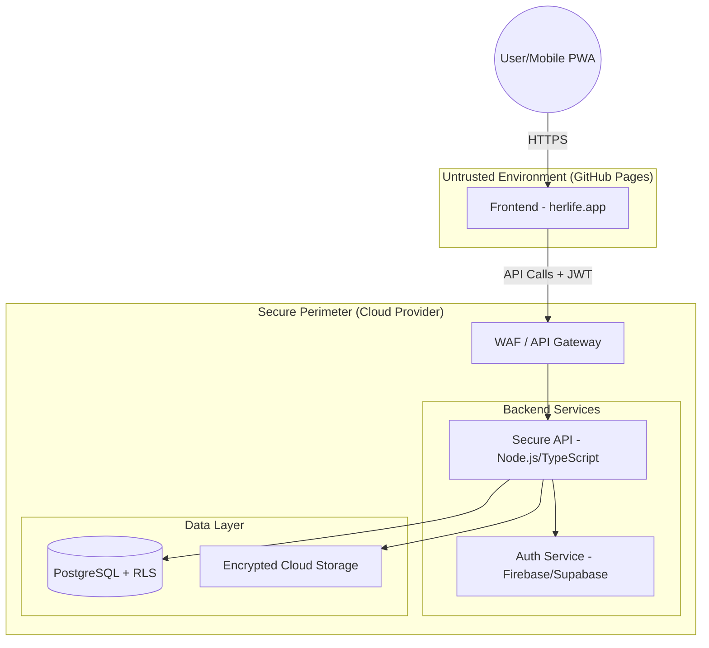

# HerLife Production-Grade Secure Architecture

This document outlines the zero-trust, defense-in-depth architecture for the HerLife wellness application.

## 1. Full Frontend/Backend Architecture

HerLife follows a **Zero-Trust Architecture** where the frontend is considered an untrusted environment. All security enforcement occurs at the network and application layers of the backend.



### Why this layer exists:
- **WAF:** Prevents common web attacks (SQLi, XSS, DDoS).
- **Untrusted Frontend:** Assumes the client can be compromised; never trusts client-side validation.

---

## 2. Authentication Architecture

We utilize **OpenID Connect (OIDC)** with Apple and Google Sign-In, coupled with **JWT (JSON Web Tokens)** for stateless authorization.

- **Identity Provider:** Firebase Auth or Supabase Auth.
- **Token Strategy:**
    - Short-lived Access Tokens (1 hour).
    - Refresh Token Rotation (one-time use refresh tokens).
- **Multi-Factor Authentication (MFA):** Strongly recommended for production users.

### Request Flow:
1. User authenticates with Apple/Google.
2. Frontend receives an ID Token and exchanges it for a Session JWT.
3. Every API request includes `Authorization: Bearer <JWT>`.
4. Backend verifies JWT signature and expiration.

---

## 3. Database Schema

Every record **MUST** be linked to a `user_id`.

```sql
-- Core Users Table
CREATE TABLE users (
    id UUID PRIMARY KEY REFERENCES auth.users(id),
    email TEXT UNIQUE,
    created_at TIMESTAMPTZ DEFAULT now()
);

-- Trusted Contacts
CREATE TABLE trusted_contacts (
    id UUID PRIMARY KEY DEFAULT gen_random_uuid(),
    user_id UUID REFERENCES users(id) NOT NULL,
    name TEXT NOT NULL,
    phone TEXT NOT NULL,
    created_at TIMESTAMPTZ DEFAULT now()
);

-- Encrypted Aura Chats (Blobs)
CREATE TABLE encrypted_aura_chats (
    id UUID PRIMARY KEY DEFAULT gen_random_uuid(),
    user_id UUID REFERENCES users(id) NOT NULL,
    encrypted_payload TEXT NOT NULL, -- AES-GCM encrypted client-side
    iv TEXT NOT NULL,
    created_at TIMESTAMPTZ DEFAULT now()
);
```

---

## 4. Row-Level Security (RLS) Design

We use a **Deny-by-Default** model. RLS ensures that even if a developer forgets a `WHERE` clause in the code, the database will refuse to return data belonging to another user.

```sql
-- Enable RLS
ALTER TABLE trusted_contacts ENABLE ROW LEVEL SECURITY;
ALTER TABLE encrypted_aura_chats ENABLE ROW LEVEL SECURITY;

-- Select Policy: Users can only see their own contacts
CREATE POLICY "Users can only access their own contacts"
ON trusted_contacts
FOR ALL
USING (auth.uid() = user_id);

-- Select Policy: Users can only see their own chats
CREATE POLICY "Users can only access their own chats"
ON encrypted_aura_chats
FOR ALL
USING (auth.uid() = user_id);
```

---

## 5. Ownership-Based Access Control

Ownership is checked at three levels:
1. **JWT Level:** Backend extracts `sub` (User ID) from the verified JWT.
2. **Application Level:** Middleware verifies that the `id` of the resource being requested belongs to the `user_id` from the JWT.
3. **Database Level:** RLS (as shown above) acts as the final safety net.

---

## 6. API Structure

The API is built using a **Secure-by-Design** principle.

- **Endpoints:** `/v1/aura`, `/v1/safety`, `/v1/contacts`.
- **Validation:** Strict schema validation using Zod or Joi.
- **Error Handling:** Generic error messages to prevent information disclosure (e.g., "Resource not found" instead of "Access denied to user X's data").

---

## 7. Secure Storage Architecture

For sensitive evidence (Audio/Photos):
1. **Client-Side:** Encrypt data using Web Crypto API (AES-GCM).
2. **Transit:** HTTPS (TLS 1.3).
3. **Storage:** Objects are stored in a private bucket.
4. **Access:** Signed URLs are generated on-the-fly for the authenticated user only, with short expiration (5 mins).

---

## 8. Threat Model

| Threat | Prevention Strategy |
| :--- | :--- |
| **Broken Access Control** | RLS + Ownership Middleware |
| **Injection Attacks** | Parameterized Queries + WAF |
| **XSS** | Content Security Policy (CSP) + Output Encoding |
| **Data Leakage** | Client-Side Encryption for Aura Chats |
| **Token Theft** | Refresh Token Rotation + Secure Enclave storage on native |

---

## 9. Secure Deployment Architecture

- **CI/CD:** GitHub Actions with `npm audit`, `snyk`, and `eslint-plugin-security`.
- **Infrastructure as Code (IaC):** Terraform/Pulumi to ensure reproducible and audited infrastructure.
- **Auditing:** CloudWatch/CloudTrail logs for all administrative actions.

---

## 10. Secure Environment Variable Strategy

- **Never** commit `.env` files.
- **Production:** Use AWS Secrets Manager, HashiCorp Vault, or GitHub Secrets.
- **Frontend:** GitHub Pages variables are public. Only non-sensitive keys (like Firebase App ID) should be placed there. Sensitive business logic stays in the backend.

---

## Request Flow Example (Secure)

1. **Client** requests `GET /v1/contacts/123`.
2. **API Gateway** validates the HTTPS certificate.
3. **Auth Middleware** verifies the JWT and extracts `user_id: "abc"`.
4. **Ownership Middleware** checks if contact `123` belongs to user `abc`.
5. **Database** executes query. RLS policy `USING (auth.uid() = user_id)` ensures only user `abc`'s data is visible.
6. **Backend** returns data.
